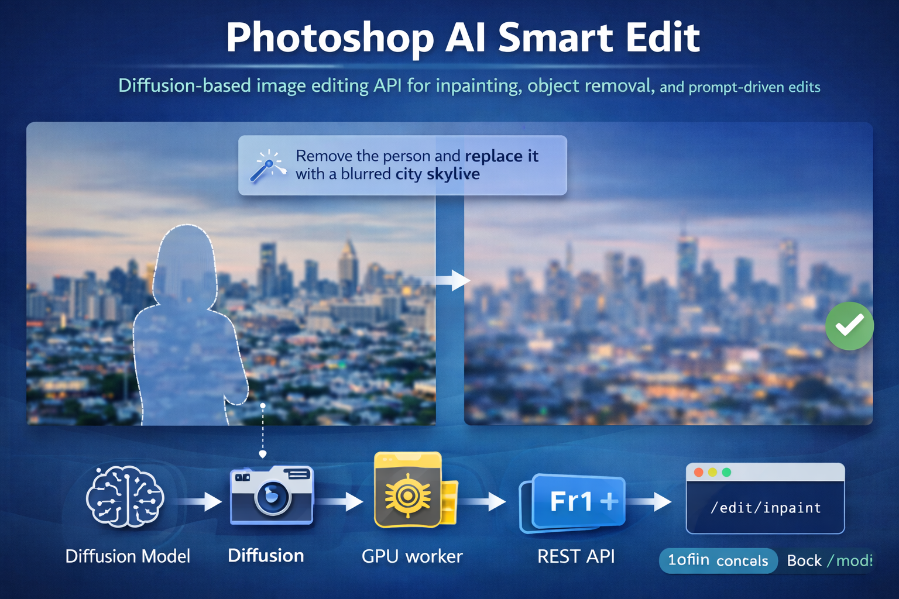

# Photoshop AI Smart Edit

**Diffusion-based image editing API for inpainting, object removal, and prompt-driven edits**

---

## Overview

**Photoshop AI Smart Edit** is a production-ready **Generative AI image editing service** that enables prompt-based image modifications using **diffusion models**.

The system allows users to:

- Remove objects from images (inpainting)  
- Modify specific regions using natural language  
- Generate realistic edits while preserving image context  
- Integrate AI editing features into creative products  

This project mirrors the core technical challenges behind **modern creative AI tools** such as Adobe Firefly.

---

## Business Problem

Creative professionals spend significant time on **manual image editing tasks**, such as:

- Removing unwanted objects  
- Replacing backgrounds  
- Retouching specific areas  
- Iterating visual concepts  

These tasks are:

- Time-consuming  
- Skill-dependent  
- Hard to automate with traditional tools  

### Example

A user wants to:

> “Remove the person in the background and replace it with a blurred city skyline”

Traditional workflows require:

- Manual masking  
- Layer manipulation  
- Expert-level skills  

---

## Solution

Build an **AI-powered image editing backend** that:

1. Accepts an image + mask  
2. Applies a natural language prompt  
3. Uses diffusion-based inpainting  
4. Returns a photorealistic edited image  

The system exposes a **REST API** that can be integrated into design tools, web apps, or creative platforms.

---

## Key Capabilities

- Diffusion-based inpainting  
- Prompt-guided image editing  
- Mask-aware generation  
- GPU-accelerated inference  
- Stateless, scalable API  
- Production deployment ready  

---

## Architecture

'''
Client (UI / Product)
        |
        v
FastAPI Gateway
        |
        v
Diffusion Inference Service
        |
        v
GPU Worker (Stable Diffusion Inpainting)
        |
        v
Generated Image Output
'''

---

## Tech Stack

### Machine Learning

- PyTorch  
- Diffusers (HuggingFace)  
- Stable Diffusion Inpainting  
- ControlNet (optional)  

### Backend

- FastAPI  
- Python 3.11  
- Async endpoints  

### Infrastructure

- Docker  
- Docker Compose  
- Kubernetes (GPU nodes)  

### Performance & Ops

- CUDA acceleration  
- Request batching  
- Model warm-up  
- Structured logging  

---

## Features

- Object removal  
- Background replacement  
- Prompt-based region editing  
- Mask upload support  
- Adjustable inference parameters  
- Low-latency responses  

---

## Repository Structure

'''
photoshop-ai-smart-edit/
│
├── apps/
│   ├── api/
│   │   ├── main.py
│   │   ├── routes/
│   │   └── schemas/
│   │
│   ├── diffusion-service/
│   │   ├── model_loader.py
│   │   ├── inpainting.py
│   │   ├── scheduler.py
│   │   └── utils.py
│
├── pipelines/
│   ├── image_preprocessing.py
│   ├── mask_processing.py
│   └── prompt_validation.py
│
├── infrastructure/
│   ├── docker/
│   ├── kubernetes/
│   └── gpu/
│
├── configs/
│   ├── model.yaml
│   ├── inference.yaml
│
├── tests/
├── examples/
│   ├── sample_inputs/
│   └── sample_outputs/
│
├── docker-compose.yml
├── requirements.txt
└── README.md
'''

---

## API Endpoints

### Inpaint Image

'''
POST /edit/inpaint
'''

**Input**

- Image (PNG/JPEG)  
- Mask (PNG)  
- Prompt (text)  
- Inference parameters  

Example:

'''
{
  "prompt": "remove the person and add a soft city skyline",
  "num_steps": 30,
  "guidance_scale": 7.5
}
'''

---

### Health Check

'''
GET /health
'''

---

## Model Details

- Base Model: Stable Diffusion Inpainting  
- Resolution: 512×512 (configurable)  
- Scheduler: DDIM / Euler  
- Precision: FP16  
- Device: CUDA (GPU)  

---

## Requirements

### Hardware

Recommended:

- NVIDIA GPU (8GB+ VRAM)  
- 16GB RAM  

Supported:

- CPU inference (slower, demo only)  

### Software

- Python 3.11  
- Docker  
- CUDA Toolkit  
- NVIDIA Container Toolkit  

---

## Installation

'''
git clone https://github.com/yourusername/photoshop-ai-smart-edit.git
cd photoshop-ai-smart-edit
'''

Create virtual environment:

'''
python -m venv .venv
source .venv/bin/activate
pip install -r requirements.txt
'''

---

## Running Locally

'''
docker-compose up --build
'''

This launches:

- API Gateway  
- Diffusion Inference Service  

---

## GPU Optimization Techniques

- Model warm-up on startup  
- Mixed precision (FP16)  
- Request batching  
- Lazy loading for ControlNet  
- Memory-efficient attention  

---

## Deployment

### Docker

Each service is containerized for portability.

### Kubernetes (Production)

Supports:

- GPU node scheduling  
- Horizontal scaling  
- Rolling updates  
- Resource quotas  

Deploy:

'''
kubectl apply -f infrastructure/kubernetes/
'''

---

## Performance Considerations

- Cold-start latency  
- GPU memory fragmentation  
- Prompt safety filtering  
- Concurrent request limits  
- Throughput vs quality trade-offs  

---

## Use Cases

- Creative AI platforms  
- Photo editing tools  
- Marketing asset generation  
- Design automation  
- E-commerce visual editing  

---

## Future Enhancements

- ControlNet pose guidance  
- Image-to-image editing  
- Style transfer  
- Prompt safety & moderation  
- User feedback loop  
- Multimodal RAG for prompts  

---

## Why This Project Matters

This project demonstrates:

- Diffusion model inference  
- GPU-accelerated ML systems  
- Scalable AI service design  
- Real-world creative AI use cases  

It reflects **the kind of backend systems used in modern creative AI products**.
